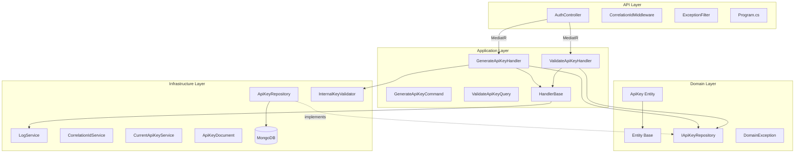
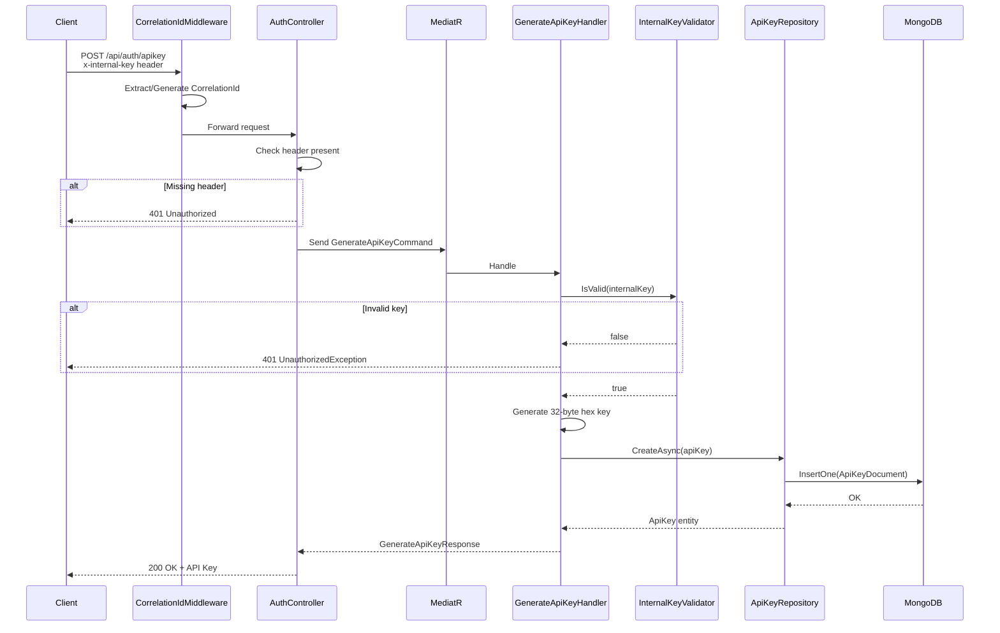
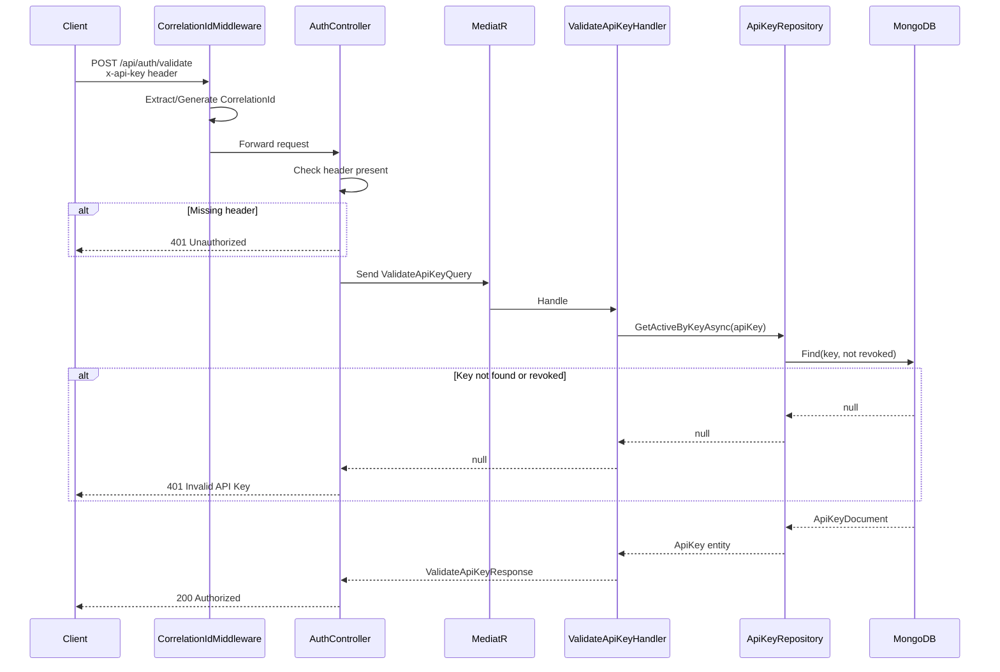
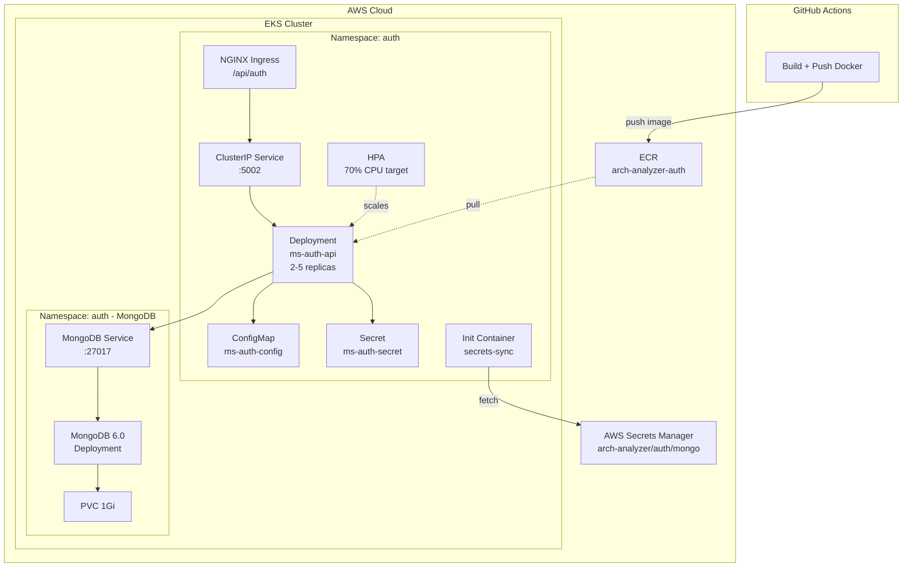
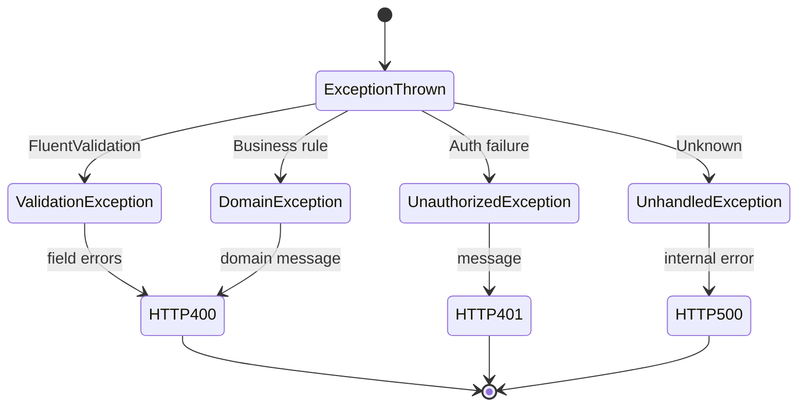
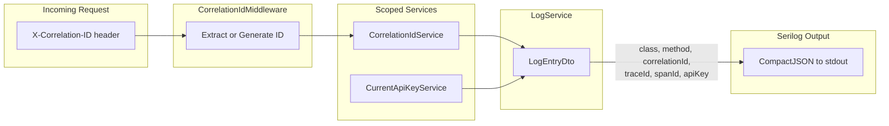

# Arch Analyzer - Auth Service

Serviço de autenticação e autorização para o projeto **Arch Analyzer**. Construído com **.NET 9** (C#) e **MongoDB**, projetado para rodar no **Amazon EKS** com deploy via **GitOps (ArgoCD)**.

## Resumo Arquitetural

- **Tipo**: Microserviço de autenticação, Clean Architecture + CQRS
- **Stack**: .NET 9, C#, MongoDB, MediatR, Serilog, FluentValidation
- **Infra**: Docker, K8s (EKS), HPA, NGINX Ingress, AWS Secrets Manager, Kustomize, GitHub Actions
- **Padrões**: Clean Architecture (4 camadas), CQRS, Mediator, Repository, Options Pattern
- **Auth**: API Key customizada (não JWT/OAuth). Chave interna protege geração de keys
- **DB**: MongoDB → coleção `apiKeys`
- **Sem filas/mensageria**. Única dependência externa = MongoDB

## Diagramas de Arquitetura

### 1. Arquitetura Interna (Camadas)

Direção de dependência entre camadas Clean Architecture.



### 2. Fluxo de Geração de API Key

Fluxo completo do `POST /api/auth/apikey`.



### 3. Fluxo de Validação de API Key

Fluxo completo do `POST /api/auth/validate`.



### 4. Topologia de Infraestrutura

Arquitetura K8s + AWS para deploy.



### 5. Máquina de Estados - Exception Handling

Mapeamento do ExceptionFilter.



### 6. Cross-Cutting Concerns

Propagação de logging + correlation.



---

## Arquitetura (Visão Simplificada)

```
┌─────────────────────────────────────────────────────────────────────┐
│                          VPC (10.0.0.0/16)                          │
│                                                                      │
│                    ┌─────┐                                           │
│                    │ ALB │ ← HTTP :80                                │
│                    └──┬──┘                                           │
│                       │                                              │
│  ┌────────────────────▼───────────────────────────────────────────┐ │
│  │                            EKS Cluster                         │ │
│  │                                                                │ │
│  │  K8s Namespace: auth                                           │ │
│  │  ┌───────────────────────────┐                                 │ │
│  │  │ MS Auth API (Pod)         │ ← Autenticação / Autorização    │ │
│  │  │ - .NET 9                  │   (Geração de API Keys)         │ │
│  │  │ - Serilog (Logs)          │                                 │ │
│  │  └─────────┬─────────────────┘                                 │ │
│  │            │                                                   │ │
│  │            │ (Conexão via String de Conexão MongoDB)           │ │
│  │  ┌─────────▼─────────────────┐                                 │ │
│  │  │ MongoDB                   │                                 │ │
│  │  │ (StatefulSet ou Atlas)    │                                 │ │
│  │  └───────────────────────────┘                                 │ │
│  └────────────────────────────────────────────────────────────────┘ │
└─────────────────────────────────────────────────────────────────────┘
```

## Fluxo da Aplicação

1. **Geração de API Keys** → Cliente envia `x-internal-key` → Auth API valida → Gera key hex 32 bytes → Persiste MongoDB.
2. **Validação de Acesso** → Outros microsserviços enviam `x-api-key` → Auth API verifica se key existe e não está revogada.
3. **Gestão de API Keys** → Coleção `apiKeys` no MongoDB armazena chaves de acesso.
4. **Logs** → Serilog estruturado em JSON captura eventos com CorrelationId para rastreabilidade.

## Estrutura do Projeto

```
ms-auth/
├── ms-auth.sln                      # Solução .NET
├── Dockerfile                       # Container build (multi-stage)
├── docker-compose.yml               # Ambiente local com MongoDB
├── .gitignore
│
├── src/
│   ├── API/                         # Controllers, Program.cs, Middlewares (CorrelationId)
│   ├── Application/                 # Commands, Queries, Handlers (CQRS via MediatR)
│   ├── Domain/                      # Entidades (ApiKey), Interfaces, Exceptions
│   └── Infrastructure/              # Repositórios MongoDB, Logging, Options
│
├── tests/
│   ├── UnitTests/                   # Testes unitários de domínio e aplicação
│   ├── IntegrationTests/            # Testes integrados com banco de dados em memória
│   └── BDD.Tests/                   # Testes BDD (Behavior-Driven Development)
│
└── k8s/
    ├── deployment.yaml              # Deploy do K8s (2 replicas, secrets-sync init)
    ├── service.yaml                 # ClusterIP :5002
    ├── ingress.yaml                 # NGINX Ingress /api/auth
    ├── configmap.yaml               # Variáveis de ambiente
    ├── aws-secret-template.yaml     # Secrets template (AWS Secrets Manager)
    ├── hpa.yaml                     # HPA 2-5 replicas, 70% CPU
    ├── namespace.yaml               # Namespace auth
    ├── kustomization.yaml           # Kustomize com image override
    └── MongoDb/                     # Manifests do MongoDB (deployment, service, pvc)
```

## Modelo Multi-Repo

| Repositório | Conteúdo | Responsabilidade |
|---|---|---|
| `arch-analyzer-infra` | Terraform + GitOps config | Infraestrutura AWS |
| `arch-analyzer-auth` (este) | Código + K8s manifests | API Autenticação |
| `arch-analyzer-ia` | Código + K8s manifests | Serviço de IA |

## Pré-requisitos

- .NET 9 SDK
- Docker & Docker Compose
- Kubectl (para deploy manual)
- Acesso ao MongoDB (local via Docker ou Cloud)

## Quick Start (Desenvolvimento Local)

```bash
# 1. Clone o repositório
git clone <repo-url>
cd ms-auth

# 2. Inicie o MongoDB e a API via Docker Compose
docker-compose up -d

# 3. Acesse o Swagger da API
# URL: http://localhost:5002/swagger/v1/swagger.json
# A API estará disponível em http://localhost:5002
```

## Segurança

### Implementado
- **Controle de Acesso**: Validação de chave interna (`x-internal-key`) para geração e `x-api-key` para validação.
- **Rastreabilidade**: `CorrelationIdMiddleware` para correlacionar requisições através do cluster.
- **CORS**: Política permissiva em ambiente de desenvolvimento. Configuração refinada em produção.
- **Health Checks**: Endpoint `/health` implementado para o Kubernetes liveness/readiness probes.
- **Segredos K8s**: Configurações sensíveis (MongoDB Connection String, Chaves) isoladas via AWS Secrets Manager + init container.

## Decisões Técnicas

| Decisão | Justificativa |
|---|---|
| .NET 9 | Performance, suporte a longo prazo, ecossistema C# robusto |
| Clean Architecture + CQRS | Separação em camadas + segregação comando/query via MediatR |
| MongoDB | Banco NoSQL flexível para armazenar chaves de acesso rapidamente |
| Serilog + CompactJson | Logs estruturados preparados para ingestão por ElasticSearch/CloudWatch |
| HPA (2-5 pods) | Auto-scaling baseado em CPU para lidar com picos de validação |
| AWS Secrets Manager | Rotação segura de secrets sem rebuild de imagem |
